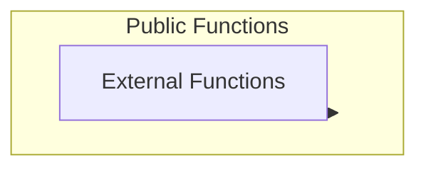
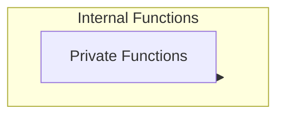

Visibility modifiers e.g `public` `private` `internal` and `external` allow us to create more robust applications by specifying access control for the public/derived contracts for our variables and functions.

It can be confusing to understand when to use what as there are cases where they overlap. e.g should we use public or external, private or internal. There are also concerns about what to use when it comes to child contracts or abstract contracts. Clarity is achieved through by reading lots of contracts and writing lots of code since their use is informed more by the requirements at hand. It can be confusing to know what to use and when. I will break down common patterns across different contracts to provide more clarity.

You can generally think of these visibility modifiers as split into two groups `public/external` and `internal/private`

---

#### **Public and External** 🔓

You should think of external as a subset of public



<br />

#### **Public** 🌍

Marking a function as public means it can be called from other contracts, called from derived contracts(child contracts) and also called directly by users in transactions. `Public` is also probably the easiest to understand as it maps well to public in any other programming language / OOP concept.

```solidity
contract Voting {
    mapping(address => bool) public hasVoted;
    mapping(uint256 => uint256) public votes;

    function vote(uint256 candidateId) public { // anyone can call this with no restrictions
        require(!hasVoted[msg.sender], "Already voted");
        hasVoted[msg.sender] = true;
        votes[candidateId]++;
    }
}
```

<br />

#### **External** 📤

The external visibility modifier is used to signal that a function should only be called by third parties. i.e. The function should only be called from the outside and not from within. This of course means only accessing functions marked as external through external users calls or through external contract function calls.

```solidity
function transfer(address to, uint256 value) external returns (bool); // this is a function that users are meant to call. Marking it external communicates this intent to readers 🚨 NOTE: if your contracts might need to call transfer itself -we would make it public instead but if the contract itself will never call this we use external instead
function allowance(address owner, address spender) external view returns (uint256);
```

<br />

There's another important difference between `public` and `external` when it comes to how complex data types e.g `uint[]` or `string` are handled as parameters in functions.

With `public`, since these can be called within the same contract they are defined, complex data types are typed as coming from memory. i.e. Arguments are copied into memory before being passed into the calling functions

```solidity
contract Example {
    // 🔄 PUBLIC - Could be called internally or externally
    // 👉️ uint256[] memory data
    function process(uint256[] memory data) public pure returns (uint256) {
        // ⛽ Since data could come from internal calls,
        // Solidity COPIES it to memory to be safe

        // ✅ Can modify because it's in memory
        data[0] = 999;
        return data[0];
    }

    function internalCall() public {
        // ✅ myArray occupies space in memory ie virtual machine memory
        uint256[] memory myArray = new uint256[](3); // stored at a memory address
        process(myArray); // argument is passed from memory
    }
}
```

<br />

However with functions marked external, since we know these are called externally through user transactions or JSON RPC, the params are encoded into [Calldata](https://www.cyfrin.io/glossary/calldata-solidity). Read more on what calldata is on the provided link but essentially, arguments are encoded into the function calls.

```solidity
contract Example {
    // 🔵 EXTERNAL - Only called from outside
    function process(uint256[] calldata data) external pure returns (uint256) {
    // data is available as part of the calling of this function
    // we can check the transaction to get the calldata and access data
        // ⛽ Cheaper! Data stays in calldata, we don't need to copy into memory, memory has a cost to use

        return data[0];
    }
}
```

<br />

This cost difference is the practical reason the distinction matters. Copying arguments into memory costs gas, so for functions that take complex data types like arrays or strings, `external` functions are cheaper to call than `public` ones since the arguments are read directly from calldata instead of being copied into memory. This is why functions that are only ever called from outside are usually marked `external`.

---

#### **Internal and Private** 🔒

It might help to think of private as a subset of internal



<br />

#### **Internal** 🏠

Functions/Variables marked as internal are only meant to be called/accessed internally. This means they can only be accessed from the contract where they are defined or from contracts that derive from it ie child contracts. Internal functions are used to communicate contract implementation details e.g for re-usable code blocks that might be used across different public functions, validation etc.

```solidity
contract MyToken {
    mapping(address => uint256) public balances;

// we only want this to be accessed externally
// e.g through users calling transfer
    function transfer(address to, uint256 amount) external {
    // do something
        _transfer(msg.sender, to, amount);
    }

// we only want this to be accessed externally
// e.g through users calling transfer
    function transferFrom(
        address from,
        address to,
        uint256 amount
    ) external {
    // do something
        _transfer(from, to, amount);
    }

 // called by transfer and transferFrom. We want to re-use this across different functions, implemented internally and only called after we have completed our checks. This can also be used by child contracts
 // we might expose public facing functions to our users, perform some validation and only then call internal functions
    function _transfer(
        address from,
        address to,
        uint256 amount
    ) internal {
        require(balances[from] >= amount, "Not enough tokens");

        balances[from] -= amount;
        balances[to] += amount;
    }
}
```

<br />

You'll often see a pattern where contracts have `public or external` functions e.g `mint()` or `burn()` that have their corresponding internal `_mint()` and `_burn()` functions. The main functions are defined as `public` or `external` and are called directly by the user, the function then does some logic before calling the corresponding reusable function prefixed with an underscore.

Internal also makes a lot of sense when used with child contracts.

```solidity
contract WellDesignedToken {
    mapping(address => uint256) internal balances;

    // ✅ INTERNAL core logic
    // can be called from within this contract or by children but is not public or external
    function _mint(address to, uint256 amount) internal {
        require(to != address(0), "Invalid address");
        balances[to] += amount;
    }

    // ✅ PUBLIC interface
    // we only want a third party to call this so external is better than public
    function mint(address to, uint256 amount) external {
        _mint(to, amount);
    }
}

contract DerivedToken is WellDesignedToken {
    // ✅ Child can use internal logic directly
    function airdrop(address[] calldata users, uint256 amount) external {
        for (uint i = 0; i < users.length; i++) {
            _mint(users[i], amount);  // ✅ Works!
            // ❌ cannot call mint() here - external functions can only be called from outside the contract
        }
    }
}
```

<br />

#### **Private** 🔐

Private functions/variables are only meant to be called from the contract where they are defined. A function/variable marked as private will only be accessible from within the contract itself. It cannot be called by other contracts, by child contracts or by users through transactions or through RPC endpoints. It's important to remember that private only applies to how the function or variable is accessed and that any data on the blockchain is publicly visible.

```solidity
// OpenZeppelin ERC20.sol (simplified)
contract ERC20 {
    mapping(address => uint256) private _balances;  // 🔒 PRIVATE!
    mapping(address => mapping(address => uint256)) private _allowances;  // 🔒 PRIVATE!
    uint256 private _totalSupply;  // 🔒 PRIVATE!

     // ✅ INTERNAL - Core transfer logic
    function _transfer(address from, address to, uint256 amount) internal virtual {
        require(from != address(0), "ERC20: transfer from zero address");
        require(to != address(0), "ERC20: transfer to zero address");
        require(_balances[from] >= amount, "ERC20: insufficient balance");

        _balances[from] -= amount;
        _balances[to] += amount;
    }

    // ✅ INTERNAL - Children can use this
    // balance and totalSupply only updated within this contract
    function _mint(address account, uint256 amount) internal virtual {
        _totalSupply += amount;
        _balances[account] += amount;
    }

    // ✅ INTERNAL - Children can use this
    function _burn(address account, uint256 amount) internal virtual {
        _balances[account] -= amount;
        _totalSupply -= amount;
    }

    // ✅ PUBLIC - Users call this
    // also public because this contract might call transfer so use implementation to decide whether to use public or external. if we never call this from the contract itself, mark as external
    // we mark this as virtual to signal children can provide their own implementation
    function transfer(address to, uint256 amount) public virtual returns (bool) {
        _transfer(msg.sender, to, amount);
        return true;
    }
}

```

<br />

A child contract might implement the parent and add its own logic like this

```solidity
// 👶 CHILD - Adds fee on transfer
contract FeeToken is ERC20 {
    uint256 public feePercent = 1; // 1% fee

    // ✅ Override transfer to add fee
    function transfer(address to, uint256 amount) public override returns (bool) {
        uint256 fee = (amount * feePercent) / 100;
        uint256 amountAfterFee = amount - fee;

        // 🔓 Can call internal _mint (fee goes to contract owner)
        _mint(owner, fee);

        // ✅ Call parent transfer
        return super.transfer(to, amountAfterFee);

         // ✅ Option 2: Call parent's internal _transfer directly (also works!)
        // _transfer(msg.sender, to, amountAfterFee);
        // return true;
    }

    address public owner;
    constructor() {
        owner = msg.sender;
        _mint(msg.sender, 1000000); // Mint initial supply
    }
}
```

<br />

---

#### **References**

- [https://www.alchemy.com/docs/when-to-use-storage-vs-memory-vs-calldata-in-solidity](https://www.alchemy.com/docs/when-to-use-storage-vs-memory-vs-calldata-in-solidity)
- [https://drew.is-a.dev/blog/memory-storage-calldata/](https://drew.is-a.dev/blog/memory-storage-calldata/)
- [https://www.cyfrin.io/glossary/calldata-solidity](https://www.cyfrin.io/glossary/calldata-solidity)
